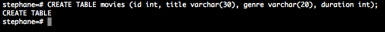
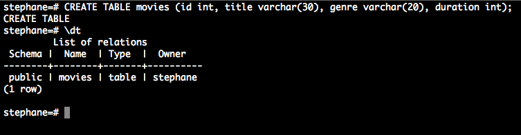
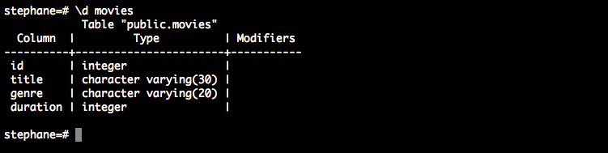
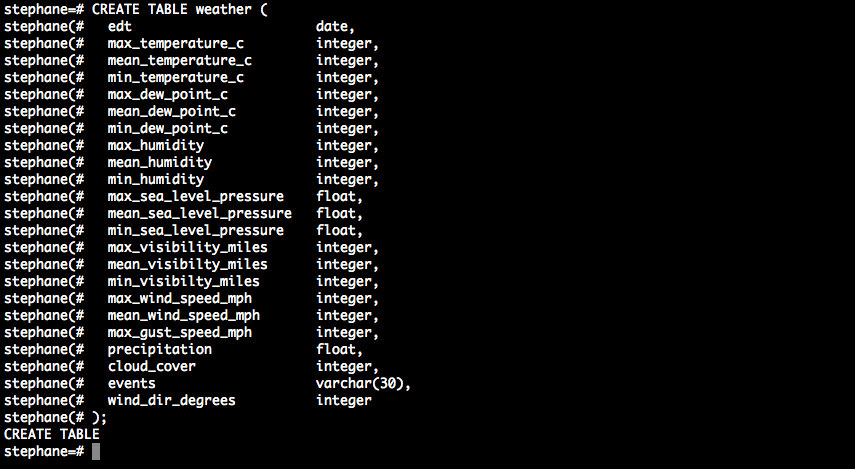
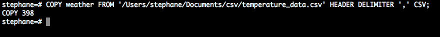

# Practice SQL with PostgreSQL

We want to know how was the weather in Florida from *2010-3-12* to *2011-4-13*.

### I. Installation

Before you manage your data with PostgreSQL, you need to:

1. **Install** PostgreSQL in your system. I won't explain here how to install PostgreSQL because it really depends on which OS you use.
I personnally work on OSX and I installed PostgreSQL via [Postgre.app].

[Postgre.app]:http://postgresapp.com/

1. **Import (git clone)** this repository locally.

### II. What does this repository contains

This repository owns two files:

- *[temperature_data.csv]* : this file holds our data, all about the weather in Florida. The file format is CSV and this lets us the ability to modify really easily with Excel (create/change/remove a group of data for instance).  
- */sql/[weather_table.txt]* : this file contains the query to create a new table called 'weather' that will holds our data. These data comes from [Wunderground.com].
I wanted you not to lose time. Say 'thank you'! :-)

[temperature_data.csv]: https://github.com/Stephanyan/practice_sql/blob/master/temperature_data.csv
[weather_table.txt]:https://github.com/Stephanyan/practice_sql/blob/master/sql/weather_table.txt
[Wunderground.com]:http://www.wunderground.com/history/airport/KORL/2010/3/12/CustomHistory.html?dayend=13&monthend=4&yearend=2011&req_city=&req_state=&req_statename=&reqdb.zip=&reqdb.magic=&reqdb.wmo=&MR=1

### III. Basics

I consider that you already know basics about the SQL language. If not, please do the beautiful tutorial ['Try SQL'] made by Code School.

['Try SQL']:https://www.codeschool.com/courses/try-sql

### IV. Setup

You did it? Woaw, you know now the basics to manage database and tables with SQL! Let's practice in your own console:

- Open PostgreSQL by getting in your console. Run the simple command line ```psql``` and you will done! For the Mac users who have installed [Postgre.app], just open this app in the /applications/ directory and click 'open psql'. PostgreSQL is now launched!


- Run ```\l``` (backslash + l ) : it lists all databases that you have on your system.


- As you can see, we already have several default databases. Let's choose the one with our name, and to be sure we work in that database, run ```\connect name_of_database```.


- Now, we want to list all tables that our database called 'stephane' has. To list tables, run ```\dt```.


- Oops. None! No problem, it is a chance to review our basics! Let's create a new and first table in this database. Do you remember?



- So simple, right? We may want to check if our table has been well created with ```\dt```.



- Run ```\d table_name``` to see the schema of one table (fields/columns names, datatypes, etc.).



### V. Import a CSV file

Now, you can practice by adding, udpating and removing datas in this table! But what if we want to create lot of new datas like 530 new rows or 3 new columns/categories in this table? What if we want to add external database that we create with Excel for example? **[CSV]** files (Comma-separated values) will help us.

Imagine. Your company owns 34294 employees and each employees owns a first name, a lastname, a birthday, an address, an email address, a function and a salary. Obviously none of them owns the same datas. You already entered this data with Excel, what if we want to play with this data with PostgreSQL? You won't write all your data again: convert your file from the Excel format (like .xlsx) to the .csv format! Why? The CSV format is a format that Excel will know... and *SQL* will know too.

[CSV]:http://en.wikipedia.org/wiki/Comma-separated_values

- Once you have genered your .csv file, we will create a new table that will host our external data (you can use an existing table) called 'weather'. Oh, look at */sql/[weather_table.txt]*. Just copy and past EVERYTHING into your console and hit the *Return* button.



- No let's **import** our data located in our .csv file into PostgreSQL. This is how we do:

```COPY table_name FROM '/your/path/to/your/file.csv/' DELIMITER ',' CSV;```

> We need to use the *DELIMITER* clause (followed by **','**) to let SQL understand that each column is **delimited** by a comma (= semi-colon). We also need to write *CSV* at the end to specify what syntax we use (yes the first step is still needed).



- Don't panic, I used 'HEADER' because **I don't want to import headers given by temperature_data.csv**. We don't need them since we already have created headers (= columns names) !

That's it! Now you can play with your new datas inside PostgreSQL! :-)

For any question, feel free to create an issue.
